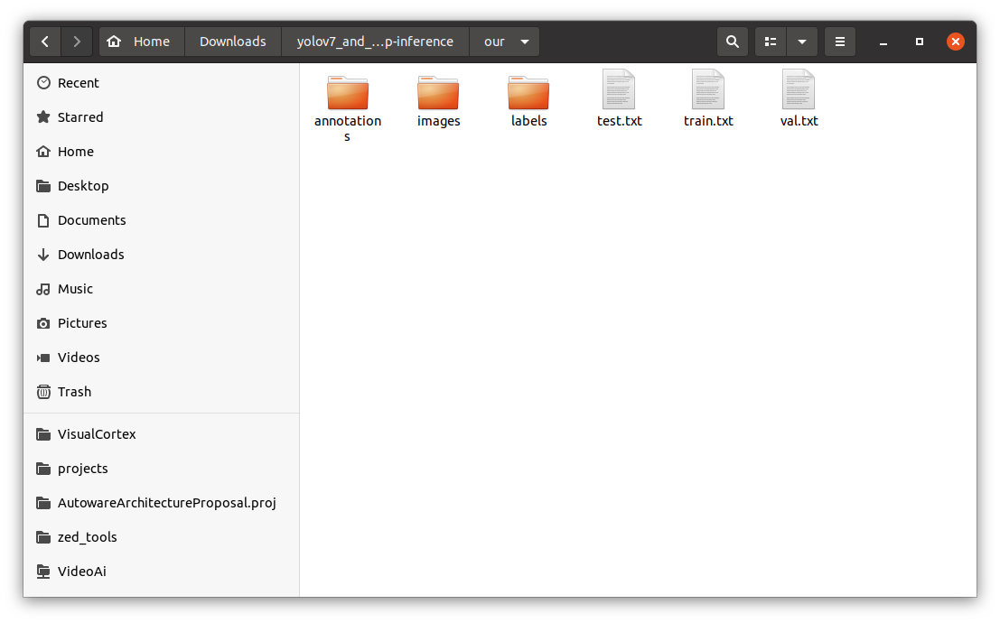

# In development...

#### The repository is taken as a basis: [WongKinYiu/yolov7 (github.com)](https://github.com/WongKinYiu/yolov7 "WongKinYiu/yolov7 (github.com)")

I will show by my example what needs to be done to run a trained yolov7 network on a custom dataset with custom classes.  
I advise you to perform all actions in a virtual environment, however, this is not necessary.

## 1. Preparing data for training

To begin with, I advise you to create a folder with your training files in the folder yolov7_and_tensorrt-cpp-inference. I have this folder called ***our*** with the following structure:



* If you have just a set of photos, but you need to scatter them in the folders train, val and test, then you need to run the file **split_files_to_train-val-folders.py** in which you need to specify the folder with the path images and the folders where you want to save the split data.  
In this code, I divide the images only into **train** and **val**. However, you can modify the code to split the data into **train**, **val** and **test**, but this is not necessary.
  + ```shell ``` 


First you need to create your custom.yaml in the ***data*** folder. You can do this with the following commands (run in the terminal):
``` shell
cd data
touch custom.yaml
```

And then open this file in any text editor, for example, Sublime Tex and edit the file (I'll show you with my example).
```yaml
# train and val data as 1) directory: path/images/, 2) file: path/images.txt, or 3) list: [path1/images/, path2/images/]
train: ./our/train.txt  # ~2605 images
val: ./our/val.txt  # ~380 images
test: ./our/test.txt  # ~330 images

# number of classes
nc: 13

# class names
names: [ 'lights', 'trailer', 'animal', 'break_light', 'train', 'trafficlight', 'sign', 'bus', 'truck', 'person', 'bicycle', 'motorcycle', 'car' ]
```

If you, like me, did not have ready-made txt files, but only the annotations folder with the file .json, then you need:
- split the file .json for three files .json
  you can do this using [pyodi coco split](https://gradiant.github.io/pyodi/reference/apps/coco-split/ "pyodi coco split")
  - to do this, install pyodi into the system by typing in the terminal  
    ```shell pip install pyodi```
  - and run the following code in the terminal first once:  
    ```shell pyodi coco random-split YOUR_PATH_TO_JSON.json ./random_coco_split --val-percentage 0.3 ```
  - In fact, we got two .json file. This is **train**, where there is 70% of the data and **val**, where there is 30% of the data. Now, according to the same principle, we will split the **val** data into **val** and **test**. To do this, specify in --val-percentage not 0.3, but 0.1.
    ```shell pyodi coco random-split YOUR_PATH_TO_SECOND_JSON_AFTER_PREVIOUS_CODE.json ./random_coco_split --val-percentage 0.1 ```
  
As a result, we get 3 files: train (70% of the data), val (20% of the data) and test (10% of the data).
- Next we need to turn these .json files to txt files.

#### We are going to execute the following command:

Single GPU training

``` shell
# finetune p5 models
python train.py --workers 8 --device 0 --batch-size 32 --data data/custom.yaml --img 640 640 --cfg cfg/training/custom.yaml --weights '' --name yolov7-custom --hyp data/hyp.scratch.custom.yaml

# finetune p6 models
python train_aux.py --workers 8 --device 0 --batch-size 16 --data data/custom.yaml --img 1280 1280 --cfg cfg/training/custom.yaml --weights '' --name yolov7-custom --hyp data/hyp.scratch.custom.yaml
```

Multiple GPU training

``` shell
# train p5 models
python -m torch.distributed.launch --nproc_per_node 4 --master_port 9527 train.py --workers 8 --device 0,1,2,3 --sync-bn --batch-size 128 --data data/custom.yaml --img 640 640 --cfg cfg/training/custom.yaml --weights '' --name yolov7-custom --hyp data/hyp.scratch.custom.yaml

# train p6 models
python -m torch.distributed.launch --nproc_per_node 8 --master_port 9527 train_aux.py --workers 8 --device 0,1,2,3,4,5,6,7 --sync-bn --batch-size 128 --data data/custom.yaml --img 1280 1280 --cfg cfg/training/custom.yaml --weights '' --name yolov7-custom --hyp data/hyp.scratch.custom.yaml
```

## 2. Item B
## 3. Item C
