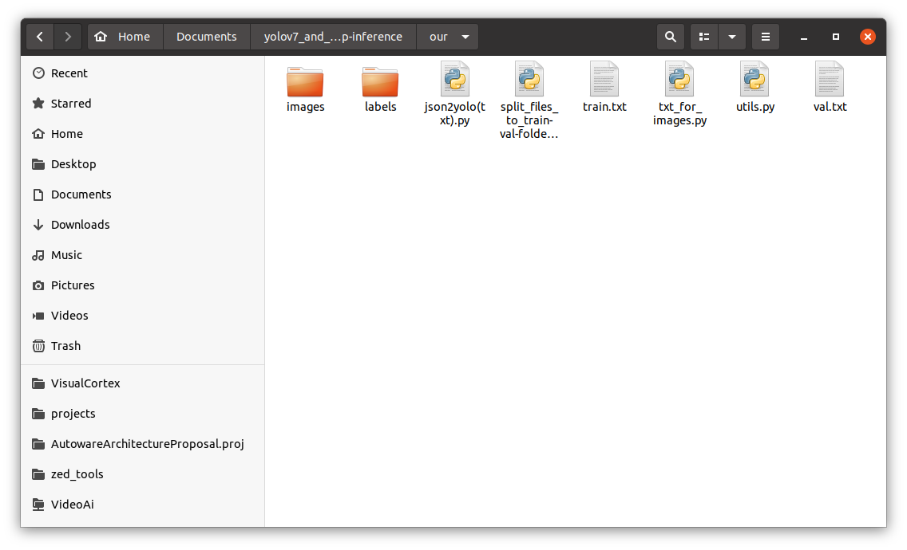

# In development...

#### The repository is taken as a basis: [WongKinYiu/yolov7 (github.com)](https://github.com/WongKinYiu/yolov7 "WongKinYiu/yolov7 (github.com)")

I will show by my example what needs to be done to run a trained yolov7 network on a custom dataset with custom classes.  
I advise you to perform all actions in a virtual environment, however, this is not necessary.

First of all, you need to download the repository to your computer. Open a terminal and enter the command:  
`git clone https://github.com/Egorundel/yolov7_and_tensorrt-cpp-inference.git`  

Next, you need to install all the necessary libraries for your work. To do this, launch the terminal from the downloaded folder and run the command:  
`pip install -r requirements.txt`

You can also download pre-prepared dataset at [our.zip (disk.yandex.ru)](https://disk.yandex.ru/d/gaYUNb3FHXQg0A "our.zip (disk.yandex.ru)") and enter the password: **KnFt**

# 1. Preparing data for training

To begin with, I advise you to create a folder with your training files in the folder ***yolov7_and_tensorrt-cpp-inference***. I have this folder called ***our*** with the following structure:



You can take the files **json2yolo(txt).py**, **split_files_to_train-val-folders.py**, **txt_for_images.py** and **utils.py** from the ***useful_python_codes*** folder and move them to your dataset folder.

**Situations you may encounter:**

* If you have just a set of photos, but you need to scatter them in the folders **train**, **val** and **test**, then you need to run the file **split_files_to_train-val-folders.py** in which you need to specify the folder with the path _images_ and the folders where you want to save the split data.  
In this code, I divide the _images_ only into **train** and **val**. However, you can modify the code to split the data into **train**, **val** and **test**, but this is not necessary.
```python
import os
import shutil

path = 'images/'
train_path = 'images/train'
val_path = 'images/val'

files = [f for f in os.listdir(path) if f.endswith('.jpg')]  # you can change to .png or .txt

n = len(files)
train_n = int(n * 0.8)

print(n)

for i in range(train_n):
  shutil.move(os.path.join(path, files[i]), train_path)

for i in range(train_n, n):
  shutil.move(os.path.join(path, files[i]), val_path) 
```
You can do the same for _labels_, since they also need to be divided into **train** and **val** (and **test**, if you need), according to the _images_.

* You may not have files in the format .txt with markup for each frame, and there is only a file .json, which has markup. To do this, you can use the following code from [ultralytics/JSON2YOLO (github.com)](https://github.com/ultralytics/JSON2YOLO "ultralytics/JSON2YOLO (github.com"). File **general_json2yolo.py**.
* And finally, you may not have .txt files that contain paths to photos. To do this, run the file txt_for_images.py , having previously changed the path to your folder with train images there (do the same for val and test).
```python
import os

# A function that runs through images and saves paths to a file that you specify below in the output_file variable
def save_file_paths(root_dir, file):
    with open(file, 'w') as f:
        for root, dirs, files in os.walk(root_dir):
            for filename in files:
                file_path = './' + os.path.join(root, filename)[os.path.join(root, filename).find("images") + 0:]
                print(file_path)
                f.write(file_path + '\n')

# Path to folder images/train (images/val, images/test)
train_dir = 'images/train'

# Path to file, in which will be saved paths to pictures
output_file = 'train.txt'

# Starting file crawling and saving image paths to output_file
save_file_paths(train_dir, output_file)
```

* If you want to split annotations.json into 3 .json files (train, val, test), then you need to follow these steps:
  - split the file .json for three files .json
  you can do this using [pyodi coco split](https://gradiant.github.io/pyodi/reference/apps/coco-split/ "pyodi coco split")
    - to do this, install pyodi into the system by typing in the terminal  
      `pip install pyodi`
    - and run the following code in the terminal first once:  
      `pyodi coco random-split YOUR_PATH_TO_JSON.json ./random_coco_split --val-percentage 0.3`
    - In fact, you got two .json file. This is **train**, where there is 70% of the data and **val**, where there is 30% of the data. Now, according to the same principle, you will split the **val** data into **val** and **test**. To do this, specify in --val-percentage not 0.3, but 0.1.
      `pyodi coco random-split YOUR_PATH_TO_SECOND_JSON_AFTER_PREVIOUS_CODE.json ./random_coco_split --val-percentage 0.1`

As a result, you get 3 files: train (70% of the data), val (20% of the data) and test (10% of the data).    
Next you need to turn these .json files to txt files.

___

Next you need to create **custom.yaml** in the ***data*** folder. You can do this with the following commands (run in the terminal):
``` shell
cd data
touch custom.yaml
```

And then open this file in any text editor, for example, Sublime Tex and edit the file (I'll show you with my example).
```yaml
# train and val data as 1) directory: path/images/, 2) file: path/images.txt, or 3) list: [path1/images/, path2/images/]
train: ./our/train.txt # ~23840 images
val: ./our/val.txt # ~5960 images
# test: ./PATH_to_TEST_file (if you want to test later)

# number of classes
nc: 11

# class names
names: ['biker', 'car', 'pedestrian', 'trafficLight', 'trafficLight-Green', 'trafficLight-GreenLeft', 'trafficLight-Red', 'trafficLight-RedLeft', 'trafficLight-Yellow', 'trafficLight-YellowLeft', 'truck']
```

___

# 2. Training

Single GPU training

``` shell
# finetune p5 models
python3 train.py --workers 8 --device 0 --batch-size 32 --data data/custom.yaml --img 640 640 --cfg cfg/training/custom.yaml --weights '' --name yolov7-custom --hyp data/hyp.scratch.custom.yaml

# finetune p6 models
python3 train_aux.py --workers 8 --device 0 --batch-size 16 --data data/custom.yaml --img 1280 1280 --cfg cfg/training/custom.yaml --weights '' --name yolov7-custom --hyp data/hyp.scratch.custom.yaml
```

Multiple GPU training

``` shell
# train p5 models
python3 -m torch.distributed.launch --nproc_per_node 4 --master_port 9527 train.py --workers 8 --device 0,1,2,3 --sync-bn --batch-size 128 --data data/custom.yaml --img 640 640 --cfg cfg/training/custom.yaml --weights '' --name yolov7-custom --hyp data/hyp.scratch.custom.yaml

# train p6 models
python3 -m torch.distributed.launch --nproc_per_node 8 --master_port 9527 train_aux.py --workers 8 --device 0,1,2,3,4,5,6,7 --sync-bn --batch-size 128 --data data/custom.yaml --img 1280 1280 --cfg cfg/training/custom.yaml --weights '' --name yolov7-custom --hyp data/hyp.scratch.custom.yaml
```

Note: if you don't have a very powerful computer, try reducing the number of **workers** and **batch_size**.  
Also be careful, the default number of epochs=300. If you want to make training with less number of epochs, then when executing the above commands add **--epochs 100** (for example).

---

After training, you will be able to go to ***runs/train/yolov7_custom*** and look at your training results


And in the ***weights*** folder you will find the resulting weights in **.pt** format after training. We will need them again.


My results were not very good, so I was too lazy to wait for long training, and in general I trained the network with the number of epochs equal to 3 :stuck_out_tongue_closed_eyes:

___

# 3. Creating an ONNX model (.onnx)

Run the following commands in the terminal that was launched from the ***yolov7_and_tensorrt-cpp-inference*** folder

## **without NMS Plugin**:  
  ```shell
    python3 export.py --weights runs/train/yolov7-custom/weights/best.pt --grid --simplify --topk-all 100 --iou-thres 0.65 --conf-thres 0.35 --img-size 640 640 --max-wh 640
  ```

## **with batchedNMSPlugin for TensorRT 7**:  
  ```shell
    python3 export.py --weights runs/train/yolov7-custom/weights/best.pt --grid --simplify --topk-all 100 --iou-thres 0.65 --conf-thres 0.35 --img-size 640 640 --max-wh 640
  ```

  Next, go to the ***export_ONNX_with_BatchdedNMS*** folder and edit files **yolov7_add_postprocess.py** and **yolov7_add_nms.py**.
  ```shell
    cd export_ONNX_with_BatchdedNMS
  ```

  edit code of **yolov7_add_postprocess.py**:
  ```python
    graph = gs.import_onnx(onnx.load("./best.onnx"))  # change on your path

    num_classes = 11  # change on your number

    # input
    origin_output = [node for node in graph.nodes if node.name == "Concat_386"][0]  # change 386 on your last Concat number
  ```

  To see your last Concat number, you need to upload your ONNX model to [Netron App](https://netron.app/ "Netron App") from the developer [lutzroeder/netron (github.com)](https://github.com/lutzroeder/netron "lutzroeder/netron (github.com)") and look there in the properties of your latest Concat Node number.

  edit code of **yolov7_add_nms.py**:
  ```python
    number_classes = 11  # change on your number
  ```

  After making changes to these files, you need to run these commands one by one:
  ```shell
  python3 yolov7_add_postprocess.py
  python3 yolov7_add_nms.py
  ```
  Then you can also upload your resulting model to the [Netron App](https://netron.app/ "Netron App") and check that your model at the end contains the batchedNMS exactly.
  
## **with efficientNMSPlugin for TensorRT 8**:
  ```shell
    python3 export.py --weights ./yolov7-tiny.pt --grid --end2end --simplify --topk-all 100 --iou-thres 0.65 --conf-thres 0.35 --img-size 640 640
  ```
  Then you can also upload your resulting model to the [Netron App](https://netron.app/ "Netron App") and check that your model at the end contains the efficientNMS exactly.

___

# 4. Converting ONNX model to TensorRT engine (.trt or .engine)
