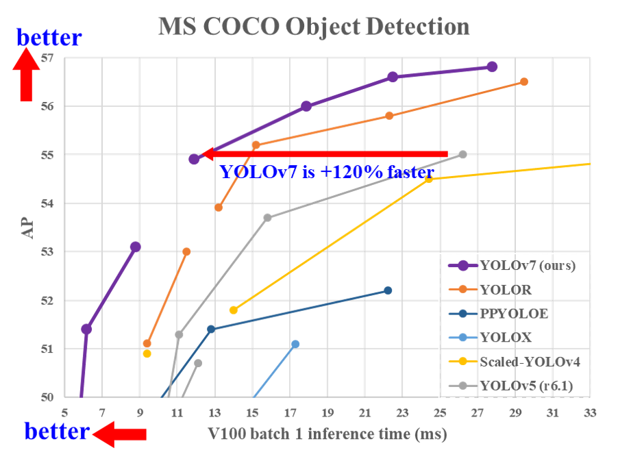

# Official YOLOv7

Implementation of paper - [YOLOv7: Trainable bag-of-freebies sets new state-of-the-art for real-time object detectors](https://arxiv.org/abs/2207.02696)

    

## Performance 

MS COCO

| Model | Test Size | APtest | AP50test | AP75test | batch 1 fps | batch 32 average time |
| :-- | :-: | :-: | :-: | :-: | :-: | :-: |
| [**YOLOv7**](https://github.com/WongKinYiu/yolov7/releases/download/v0.1/yolov7.pt) | 640 | **51.4%** | **69.7%** | **55.9%** | 161 *fps* | 2.8 *ms* |
| [**YOLOv7-X**](https://github.com/WongKinYiu/yolov7/releases/download/v0.1/yolov7x.pt) | 640 | **53.1%** | **71.2%** | **57.8%** | 114 *fps* | 4.3 *ms* |
|  |  |  |  |  |  |  |
| [**YOLOv7-W6**](https://github.com/WongKinYiu/yolov7/releases/download/v0.1/yolov7-w6.pt) | 1280 | **54.9%** | **72.6%** | **60.1%** | 84 *fps* | 7.6 *ms* |
| [**YOLOv7-E6**](https://github.com/WongKinYiu/yolov7/releases/download/v0.1/yolov7-e6.pt) | 1280 | **56.0%** | **73.5%** | **61.2%** | 56 *fps* | 12.3 *ms* |
| [**YOLOv7-D6**](https://github.com/WongKinYiu/yolov7/releases/download/v0.1/yolov7-d6.pt) | 1280 | **56.6%** | **74.0%** | **61.8%** | 44 *fps* | 15.0 *ms* |
| [**YOLOv7-E6E**](https://github.com/WongKinYiu/yolov7/releases/download/v0.1/yolov7-e6e.pt) | 1280 | **56.8%** | **74.4%** | **62.1%** | 36 *fps* | 18.7 *ms* |

